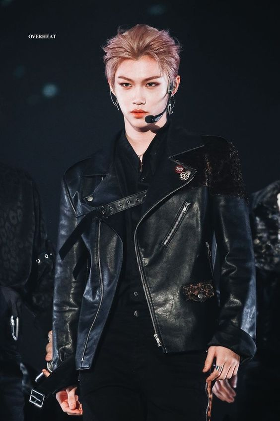

<!-- how to make a comment -->
<!-- Normal text and new line -->
Normal Text : Stray kids is a boy-band.  
They are total 8 members.
<!-- horizontal rule -->
---
<!-- Heading -->
# Stray Kidsssss ❤
## stray kids everywhere all around the world.
### You make stray kids stay, Love Stay hey hey 
<!-- paragraph -->
<p>Stray Kids (Korean: 스트레이 키즈; RR: Seuteurei Kijeu; often abbreviated as SKZ) is a South Korean boy band formed by JYP Entertainment through the 2017 reality show of the same name. The group is composed of eight members: Bang Chan, Lee Know, Changbin, Hyunjin, Han, Felix, Seungmin, and I.N. Originally a nine-piece group, member Woojin left due to undisclosed personal reasons in October 2019.

Stray Kids released their pre-debut extended play (EP) Mixtape in January 2018 and officially debuted on March 25 with the EP I Am Not, followed by other two I Am series EPs, I Am Who and I Am You. Their Clé trilogy EPs were issued in 2019, consisting of Clé 1: Miroh, Clé 2: Yellow Wood, and Clé: Levanter. The group's first studio album Go Live was released in 2020, becoming their first platinum-certified album by Korea Music Content Association (KMCA). That year, Stray Kids also made their Japanese debut with the compilation album SKZ2020 through Epic Records Japan.

In 2021, Stray Kids' second studio album Noeasy became their first million-selling album. After signing with Republic Records for promotions in the United States in 2022, the group released EPs Oddinary and Maxident (both in 2022), and the third studio album 5-Star (2023), which marked their first three appearances to top the US Billboard 200 and entered the UK Albums Chart. Maxident was certified triple-million in album sales by the KMCA, making them just the second group to achieve this in Korean history. As of October 2022, Stray Kids has sold over 10 million albums across both Korean and Japanese releases.</p>
<!-- Italic  -->
_Love Stay_  
<i>Love Stray Kids</i>
<!-- bold -->
__Stray Kids Recent World Tour - USA__
<!-- strike-through -->
Don't fall into ~~TRAP~~ for fake fan meeting.  
Always Stay Tuned With Our Website for true news.  
<!-- single line code -->

`<!-- This is inline code of our website. -->`   
`<h1> Heading Here </h1>` 

#### page1
<!-- multiple line code -->

```html
<!DOCTYPE html>
<html lang="en">
<head>
    <meta charset="UTF-8">
    <meta name="viewport" content="width=device-width, initial-scale=1.0">
    <link rel="stylesheet" href="p2.css">
    <title>Dynamic-card</title>
</head>
<body>
    <h1>Top Selling Laptops</h1>
    <div class="posts"></div>
    <script src="p2.js"></script>
</body>
</html>
```

<br>

#### page2

```html
<!DOCTYPE html>
<html lang="en">
<head>
    <meta charset="UTF-8">
    <meta name="viewport" content="width=device-width, initial-scale=1.0">
    <link rel="stylesheet" href="p2.css">
    <title>Dynamic-card</title>
</head>
<body>
    <h1>Top Selling Laptops</h1>
    <div class="posts"></div>
    <script src="p2.js"></script>
</body>
</html>
```

```javascript
console.log("Hello Stray kids!");
```

<br>

## Members of SKZ name 
___
<ol>
<li>Bang Chan(Christoffer)-Leader,Producer,Dancer,Rapper,Vocalist</li>
<li>Lee Yongbok(Felix)-Dancer,Rapper</li>
<li>Lee Minho(Rhino)-Main Dancer,Vocalist</li>
<li>Hwang Hyunjin(Sam)-Dancer,Rapper</li>
<li>Seungmin(Sky)-Vocalist</li>
<li>Changbin(Dwekki)-Rapper,Producer</li>
<li>Han-Rapper,Vocalist,Producer</li>
<li>I.N-Vocalist  </li>
<ol>  

  <br>

<!-- <ul>
<li>Woojin-Vocalist(Left the band)</li>
</ul> -->
- woojin-Vocalist(Left the band)
  - nesting item1.1.
  - nesting item1.2.
- hehe  
<!-- Task-list -->

<br>

## Task-List
- [x] World Tour UK
- [x] World Tour Malaysia
- [x] World Tour Australia
- [] World Tour Bangladesh

<!-- Link -->

<br>

## Link
<!-- Automatic Link -->
https://straykids.jype.com

<!-- Disable link -->
`https://straykids.jype.com`

<!-- Markdown-link -->
[Stray kids official](https://straykids.jype.com)  
#### only skz
[Stray kids][websitelink]

<!-- Images -->

<br>

## Visual of SKZ

<!--  -->

❤️❤️❤️❤️❤️❤️
<br><br>

## Leader of SKZ


<!-- emoji from emojipedia.com -->

❤️❤️❤️❤️❤️
<br> pic2 alignment issue fixed.
<br>

<!-- Table -->

## charts and schedule

| Name | Live date | Live time | Fan meet |
|--------|-----------|----------|-----------|
| Bang Chan | 20/06/2023 | 9.00 pm | 22/06/2023 |
| Felix | 21/06/2023 | 9.00 pm | 23/06/2023 |
| Hyunjin | 22/06/2023 | 9.00 pm | 24/06/2023 |
| Han | 23/06/2023 | 9.00 pm | 25/06/2023 |
| Seungmin | 24/06/2023 | 9.00 pm | 26/06/2023 |
| I.N | 25/06/2023 | 9.00 pm | 27/06/2023 |
| Changbin | 26/06/2023 | 9.00 pm | 28/06/2023 |

_Buy Golden Ticket to meet all of them._


<!-- All link is here -->

[websitelink]: https://straykids.jype.com


